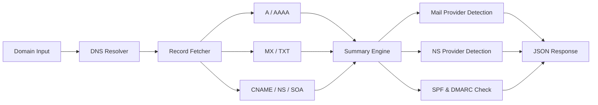

# DNS Record Checker & Domain Health Monitor

[](https://opensource.org/licenses/ISC)
[](https://apify.com/george.the.developer/dns-record-checker)
[](https://nodejs.org)
[](https://apify.com/george.the.developer/dns-record-checker)

Full DNS lookup for any domain. Returns A, AAAA, MX, TXT, CNAME, NS, SOA records plus a smart summary that detects your mail provider, nameserver provider, and SPF/DMARC status. One API call, instant response, no cold start.

## 简介

任何域名的完整DNS查询。返回A、AAAA、MX、TXT、CNAME、NS、SOA记录，自动检测邮件提供商和SPF/DMARC状态。

## Architecture



## What You Get

One API call returns everything:

| Data Point | Details |
|------------|---------|
| DNS Records | A, AAAA, MX, TXT, CNAME, NS, SOA |
| Mail Provider | Google Workspace, Microsoft 365, Zoho, ProtonMail, and more |
| Nameserver Provider | Cloudflare, AWS Route 53, GoDaddy, DigitalOcean, and more |
| SPF Status | Detected or missing |
| DMARC Status | Detected or missing |
| Record Count | Total records across all types |

## Who Uses This

- **Domain investors** managing portfolios of hundreds of domains
- **Security teams** auditing infrastructure configuration
- **SEO agencies** checking client domain health before onboarding
- **DevOps teams** monitoring DNS configuration changes
- **Compliance teams** verifying email authentication (SPF/DMARC)

## Quick Start (cURL)

```bash
# Check a domain (GET request)
curl "https://george-the-developer--dns-record-checker.apify.actor/check?domain=stripe.com"

# Health check
curl "https://george-the-developer--dns-record-checker.apify.actor/health"
```

## API Endpoints

This actor runs in **Standby Mode** for instant responses. No cold start, no queue wait.

### `GET /check?domain={domain}`

Returns all DNS records and a summary for the given domain.

### `GET /health`

Returns service health status.

## Response Example

```json
{
  "domain": "stripe.com",
  "queriedAt": "2026-04-12T15:00:00Z",
  "records": {
    "A": ["104.18.3.10", "104.18.2.10"],
    "AAAA": [],
    "MX": [
      { "priority": 1, "exchange": "aspmx.l.google.com" },
      { "priority": 5, "exchange": "alt1.aspmx.l.google.com" }
    ],
    "TXT": [
      "v=spf1 include:_spf.google.com ~all",
      "v=DMARC1; p=reject; rua=mailto:dmarc@stripe.com"
    ],
    "CNAME": [],
    "NS": ["ns1.cloudflare.com", "ns2.cloudflare.com"],
    "SOA": {
      "nsname": "ns1.cloudflare.com",
      "hostmaster": "dns.cloudflare.com",
      "serial": 2312456789
    }
  },
  "summary": {
    "hasMailServer": true,
    "mailProvider": "Google Workspace",
    "nameserverProvider": "Cloudflare",
    "hasSPF": true,
    "hasDMARC": true,
    "recordCount": 12
  }
}
```

## Pricing

| Volume | Cost | Per Domain |
|--------|------|------------|
| 1 lookup | $0.002 | $0.002 |
| 100 lookups | $0.20 | $0.002 |
| 1,000 lookups | $2.00 | $0.002 |
| 10,000 lookups | $20.00 | $0.002 |

No subscriptions. No monthly minimums. Pay only for what you use.

Compare that to commercial DNS lookup APIs that charge $50+ per month for the same data.

## Use Cases

**Domain Portfolio Audits**: Run thousands of domains through the API and get a CSV showing which ones have missing SPF or DMARC records. Fix email deliverability issues across your entire portfolio in one pass.

**Competitive Research**: Check what email and hosting providers your competitors use. Know if they are on Google Workspace or Microsoft 365, Cloudflare or AWS.

**Due Diligence**: Before acquiring a domain, check its full DNS profile. See if it has active mail servers, proper authentication records, and who manages the nameservers.

**Security Monitoring**: Set up scheduled runs to detect DNS changes. Get alerted when someone modifies your MX records or removes your DMARC policy.

## Related Actors

| Actor | What It Does | Link |
|-------|-------------|------|
| Domain WHOIS Lookup | Registration data, expiry dates, registrar info | [View](https://apify.com/george.the.developer/domain-whois-lookup) |
| Website Intelligence API | Technology stack, SEO, and security analysis | [View](https://apify.com/george.the.developer/websight-api) |
| Email Validator API | Verify email addresses for deliverability | [View](https://apify.com/george.the.developer/email-validator-api) |
| Company Enrichment API | Company data from domain or name | [View](https://apify.com/george.the.developer/company-enrichment-api) |

## Built by George Kioko

50+ actors on Apify, 869+ users. More at [apify.com/george.the.developer](https://apify.com/george.the.developer)

Questions? Open an issue on GitHub or reach out on X [@ai_in_it](https://x.com/ai_in_it).
